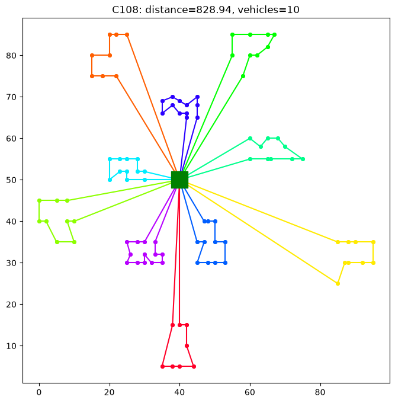
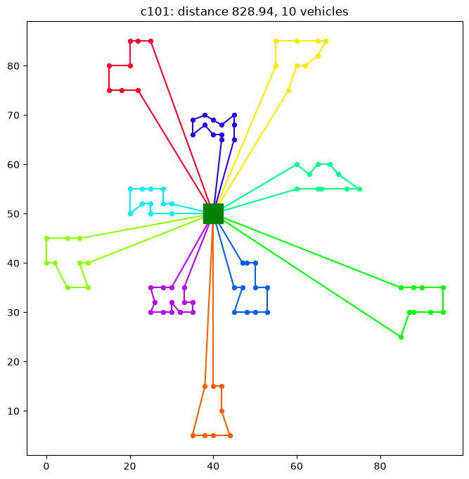
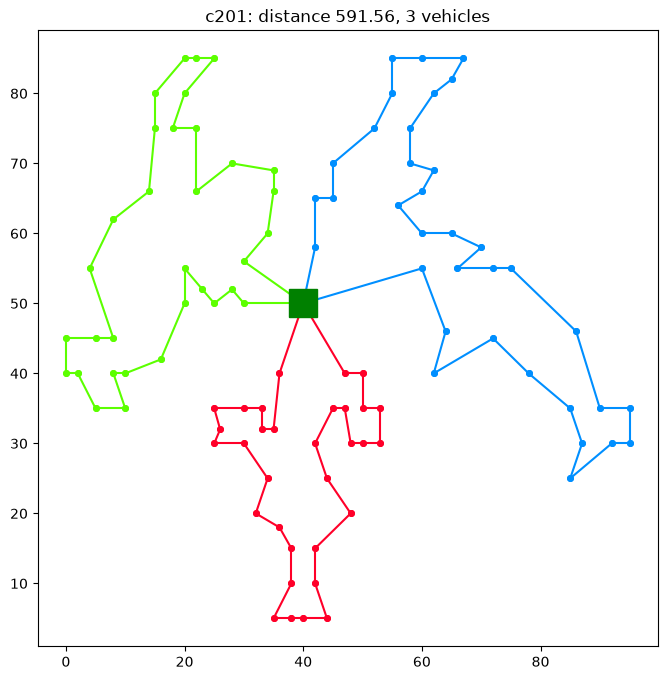
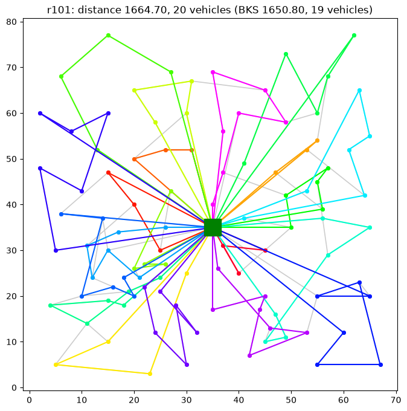
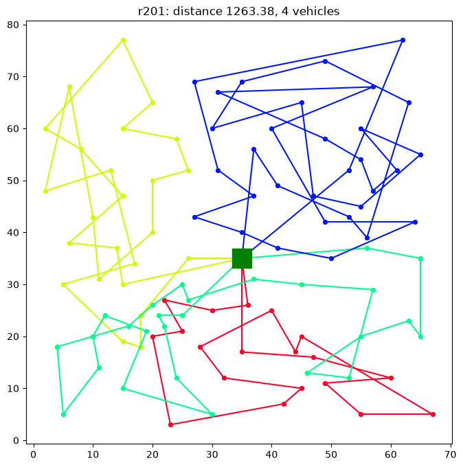
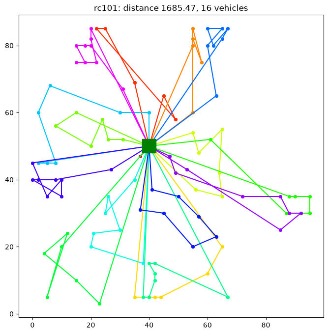
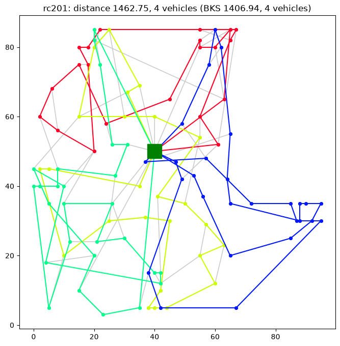

# CVRPTW · Iterated Local Search

A heuristic solver for the **Capacitated Vehicle Routing Problem with Time Windows (CVRPTW)**, written in pure Python (NumPy is used only to compute the distance matrix). Solutions are constructed greedily and then improved with **Iterated Local Search (ILS)** over a cascade of seven route operators.

<p align="center">
  
</p>

<p align="center"><em>Solomon instance C108 solved to distance 828.94 with 10 vehicles — matching the best-known value.</em></p>

## The problem

Given a depot, a fleet of identical vehicles with limited capacity, and a set of customers — each with a demand, a service time, and a `[ready_time, due_date]` time window — find routes that visit every customer exactly once, respect capacity and all time windows (arriving early means waiting; every route must also make it back to the depot before its closing time), and optimize the hierarchical Solomon objective: fewest vehicles first, then minimum total travelled distance (`ils(minimize_vehicles=False)` switches to distance-only). Instances follow the classic [Solomon benchmark](https://www.sintef.no/projectweb/top/vrptw/solomon-benchmark/) format; the full 56-instance 100-customer set ships in [`data/instances/solomon/`](data/instances/solomon/).

## The algorithm

1. **Greedy construction** — routes are built one vehicle at a time; each step picks the feasible candidate minimizing `distance × (ready_time + 1) × due_date`, a score that favors close, early, urgent customers.

2. **Iterated Local Search** — repeat until the time budget runs out or `max_failed_iters` (default 20) consecutive iterations fail to improve:
   - **Perturbation**: kick the current solution with random feasible inter-route relocations. The kick strength is *adaptive*: it grows with each non-improving iteration (capped at 3× the base) and resets on improvement.
   - **Route elimination**: try to empty the smallest route by relocating all of its customers into the others (all-or-nothing, feasibility-only) — the move that actually shrinks the fleet; the local search that follows repairs the distance damage.
   - **Local search**: a first-improvement cascade over seven operators — inter-route *cross* (tail swap), intra-route *relocate*, *2-opt* (geometrically gated: only tried where route segments actually cross), and *or-opt* (2–3 customer chains, both orientations), then inter-route *exchange*, *relocate*, and *or-opt*. Any accepted move restarts the cascade from the top. `ils(n_neighbors=k)` optionally switches the inter-route operators to a *granular neighborhood*: only moves creating an arc to one of the moved customer's k nearest nodes are evaluated — a large win on distance-dominated instances (it has hit the exact best-known 824.78 on C104 in a 60 s run), off by default because exhaustive scanning keeps a small fleet-size edge on vehicle-contested instances.
   - **Acceptance**: random walk — the search continues from the perturbed solution even when it is worse, while the best solution found is tracked separately, compared lexicographically on (vehicles, distance). (Restart-from-best acceptance is available via `ils(restart_from_best=True)`, but lost an A/B test against the random walk.)

Feasibility checking is the hot path, so it is engineered accordingly: routes carry prefix sums of cumulative demand, distance, and arrival times, and candidate moves are validated with `check_route_from`, which resumes from the unchanged prefix's cached state in O(1) and only replays the modified suffix. The distance matrix is stored as plain nested lists — scalar lookups dominate, and list indexing beats NumPy's per-access overhead by ~1.7× in local-search throughput. Accepted moves build a new solution from shallow copies — nothing is ever deep-copied and vehicles are never mutated after insertion.

Runs are reproducible: every randomized component threads a single `rng`, so `ils(..., rng=random.Random(seed))` gives a deterministic trajectory isolated from global random state. That covers even runs cut off by the time limit — the seed determines everything except where the clock stopped the run, and `stop_after=stop_after_from_stats(stats)` replays a finished run's exact stopping point (down to the local-search candidate the deadline interrupted) without a clock. An independent full-rebuild checker, `verify_solution(sol, instance)`, re-validates a solution from scratch and returns any violations — the end-to-end tests assert it on every solver result.

## Quick start

Requires Python 3.14+ and [uv](https://docs.astral.sh/uv/).

```bash
uv sync          # install dependencies
uv run pytest -q # run the test suite
```

Solve a single instance:

```python
from cvrptw.benchmark import run_instance

result = run_instance('data/instances/solomon/c108.txt', results_dir='data/solutions/solomon')
print(result.distance, result.n_vehicles, result.improvement_pct)
```

Or drive the pieces yourself (the headline API is re-exported at the top level):

```python
import random

from cvrptw import load_instance, save_solution, get_greedy_solution, ils, ls_attempts_and_time_limit

inst = load_instance('data/instances/solomon/c108.txt')
greedy = get_greedy_solution(inst)

max_attempts, time_limit = ls_attempts_and_time_limit(inst.n_vehicles, len(inst.customers))
n_iters, best, stats = ils(greedy, max_attempts, n_perturbation_moves=5,
                           time_limit=time_limit, verbose=True,
                           rng=random.Random(42))  # optional: reproducible run

save_solution('data/solutions/solomon/c108.sol', best)
```

Compare results against the SINTEF best-known solutions:

```python
from cvrptw import compare_to_bks, format_bks_table

print(format_bks_table(compare_to_bks(results)))  # results from run_benchmark
```

The full benchmark — every instance in `data/instances/solomon/`, with progress bars and per-instance `.sol` files saved to `data/solutions/solomon/` — runs from the driver notebook:

```bash
uv run jupyter notebook notebooks/ILS.ipynb
```

## Package layout

```
cvrptw/
  model/        Customer, Instance, Route, Vehicle, Solution
  io.py         load_instance, save_solution, distance matrix
  operators/    route transforms (cross/exchange/relocate/or_opt/two_opt),
                feasibility validation + verify_solution, crossing geometry
  search/       local-search cascade, perturbation, route elimination,
                attempt/deadline budget, k-nearest-neighbor sets
  solver/       greedy construction + the ILS loop
  viz.py        route plots and per-operator search statistics
  benchmark.py  run one instance or the whole directory
  bks.py        Solomon best-known solutions + comparison table
tests/          one test file per source submodule
```

## File formats

**Instances** (`data/instances/solomon/*.txt`) — Solomon format: line 5 holds `n_vehicles capacity`; each remaining line is `id x y demand ready_time due_date service_time`. Customer 0 is the depot.

**Solutions** (`data/solutions/solomon/*.sol`) — one route per line as space-separated `customer_id arrival_time` pairs, starting and ending at the depot.

## Results

All 56 Solomon 100-customer instances, 60 s budget per instance, seeded run (`rng=random.Random(42)`), default settings (hierarchical objective), 2026-07-09. Total wall time 25.6 min — most runs converge and stop on the 20-failure streak well before the 60 s cap. Mean distance gap to the [SINTEF best-known solutions](https://www.sintef.no/projectweb/top/vrptw/solomon-benchmark/) is **+2.05%**, with the best-known vehicle count matched on **27/56** instances (total fleet 445 vs 405) and 13 instances solved to the exact best-known solution. A negative gap means less distance than the BKS using extra vehicles — not a better solution under the hierarchical objective.

| class | instances | mean gap | fleet (BKS) | at BKS fleet | time |
|-------|--:|--:|--:|--:|--:|
| C1 | 9 | +1.32% | 90 (90) | 9/9 | 1.9 min |
| C2 | 8 | +1.11% | 24 (24) | 8/8 | 3.3 min |
| R1 | 12 | +0.48% | 160 (143) | 0/12 | 4.5 min |
| R2 | 11 | +1.92% | 36 (30) | 5/11 | 7.7 min |
| RC1 | 8 | +2.09% | 106 (92) | 0/8 | 3.0 min |
| RC2 | 8 | +6.34% | 29 (26) | 5/8 | 5.2 min |
| **all** | **56** | **+2.05%** | **445 (405)** | **27/56** | **25.6 min** |

One solved instance per Solomon class from this run — the `.sol` files live in [`data/solutions/solomon/`](data/solutions/solomon/), and the images are rendered from them with `uv run python scripts/render_readme_images.py`:

<table>
  <tr>
    <td></td>
    <td></td>
  </tr>
  <tr>
    <td></td>
    <td></td>
  </tr>
  <tr>
    <td></td>
    <td></td>
  </tr>
</table>

<details>
<summary>Per-instance results</summary>

**C1**

| instance | distance | BKS distance | gap | vehicles | BKS vehicles | time (s) |
|----------|--:|--:|--:|--:|--:|--:|
| c101 | 828.94 | 828.94 | +0.00% | 10 | 10 | 4.0 |
| c102 | 828.94 | 828.94 | +0.00% | 10 | 10 | 15.9 |
| c103 | 878.36 | 828.06 | +6.07% | 10 | 10 | 25.1 |
| c104 | 872.78 | 824.78 | +5.82% | 10 | 10 | 21.8 |
| c105 | 828.94 | 828.94 | +0.00% | 10 | 10 | 4.6 |
| c106 | 828.94 | 828.94 | +0.00% | 10 | 10 | 6.9 |
| c107 | 828.94 | 828.94 | +0.00% | 10 | 10 | 7.4 |
| c108 | 828.94 | 828.94 | +0.00% | 10 | 10 | 13.0 |
| c109 | 828.94 | 828.94 | +0.00% | 10 | 10 | 14.6 |

**C2**

| instance | distance | BKS distance | gap | vehicles | BKS vehicles | time (s) |
|----------|--:|--:|--:|--:|--:|--:|
| c201 | 591.56 | 591.56 | +0.00% | 3 | 3 | 4.3 |
| c202 | 591.56 | 591.56 | +0.00% | 3 | 3 | 36.0 |
| c203 | 600.21 | 591.17 | +1.53% | 3 | 3 | 37.3 |
| c204 | 634.22 | 590.60 | +7.39% | 3 | 3 | 60.0 |
| c205 | 588.88 | 588.88 | +0.00% | 3 | 3 | 10.2 |
| c206 | 588.49 | 588.49 | +0.00% | 3 | 3 | 14.1 |
| c207 | 588.29 | 588.29 | +0.00% | 3 | 3 | 16.5 |
| c208 | 588.32 | 588.32 | +0.00% | 3 | 3 | 18.6 |

**R1**

| instance | distance | BKS distance | gap | vehicles | BKS vehicles | time (s) |
|----------|--:|--:|--:|--:|--:|--:|
| r101 | 1664.70 | 1650.80 | +0.84% | 20 | 19 | 13.2 |
| r102 | 1473.65 | 1486.12 | -0.84% | 18 | 17 | 24.9 |
| r103 | 1226.31 | 1292.68 | -5.13% | 14 | 13 | 16.8 |
| r104 | 1044.09 | 1007.31 | +3.65% | 11 | 9 | 24.8 |
| r105 | 1381.10 | 1377.11 | +0.29% | 15 | 14 | 27.2 |
| r106 | 1271.81 | 1252.03 | +1.58% | 13 | 12 | 18.4 |
| r107 | 1088.83 | 1104.66 | -1.43% | 11 | 10 | 32.8 |
| r108 | 989.43 | 960.88 | +2.97% | 10 | 9 | 26.7 |
| r109 | 1190.94 | 1194.73 | -0.32% | 13 | 11 | 15.0 |
| r110 | 1132.72 | 1118.84 | +1.24% | 12 | 10 | 11.7 |
| r111 | 1089.47 | 1096.73 | -0.66% | 12 | 10 | 40.6 |
| r112 | 1016.59 | 982.14 | +3.51% | 11 | 9 | 20.4 |

**R2**

| instance | distance | BKS distance | gap | vehicles | BKS vehicles | time (s) |
|----------|--:|--:|--:|--:|--:|--:|
| r201 | 1263.38 | 1252.37 | +0.88% | 4 | 4 | 43.4 |
| r202 | 1119.04 | 1191.70 | -6.10% | 4 | 3 | 26.2 |
| r203 | 1043.18 | 939.50 | +11.04% | 3 | 3 | 48.6 |
| r204 | 803.12 | 825.52 | -2.71% | 3 | 2 | 36.9 |
| r205 | 1058.78 | 994.43 | +6.47% | 4 | 3 | 37.3 |
| r206 | 925.98 | 906.14 | +2.19% | 3 | 3 | 40.5 |
| r207 | 887.64 | 890.61 | -0.33% | 3 | 2 | 44.7 |
| r208 | 771.18 | 726.82 | +6.10% | 3 | 2 | 53.9 |
| r209 | 930.47 | 909.16 | +2.34% | 3 | 3 | 43.4 |
| r210 | 1019.08 | 939.37 | +8.49% | 3 | 3 | 30.5 |
| r211 | 821.11 | 885.71 | -7.29% | 3 | 2 | 57.2 |

**RC1**

| instance | distance | BKS distance | gap | vehicles | BKS vehicles | time (s) |
|----------|--:|--:|--:|--:|--:|--:|
| rc101 | 1685.47 | 1696.95 | -0.68% | 16 | 14 | 5.5 |
| rc102 | 1520.20 | 1554.75 | -2.22% | 14 | 12 | 17.7 |
| rc103 | 1368.35 | 1261.67 | +8.46% | 13 | 11 | 21.3 |
| rc104 | 1165.15 | 1135.48 | +2.61% | 11 | 10 | 48.0 |
| rc105 | 1578.39 | 1629.44 | -3.13% | 15 | 13 | 25.6 |
| rc106 | 1448.30 | 1424.73 | +1.65% | 14 | 11 | 14.9 |
| rc107 | 1289.07 | 1230.48 | +4.76% | 12 | 11 | 22.6 |
| rc108 | 1199.70 | 1139.82 | +5.25% | 11 | 10 | 22.5 |

**RC2**

| instance | distance | BKS distance | gap | vehicles | BKS vehicles | time (s) |
|----------|--:|--:|--:|--:|--:|--:|
| rc201 | 1534.84 | 1406.94 | +9.09% | 4 | 4 | 24.8 |
| rc202 | 1238.85 | 1365.65 | -9.28% | 4 | 3 | 24.4 |
| rc203 | 1171.71 | 1049.62 | +11.63% | 3 | 3 | 57.0 |
| rc204 | 953.68 | 798.46 | +19.44% | 3 | 3 | 25.8 |
| rc205 | 1249.66 | 1297.65 | -3.70% | 5 | 4 | 60.0 |
| rc206 | 1187.06 | 1146.32 | +3.55% | 4 | 3 | 27.1 |
| rc207 | 1152.23 | 1061.14 | +8.58% | 3 | 3 | 53.5 |
| rc208 | 922.52 | 828.14 | +11.40% | 3 | 3 | 36.9 |

</details>
